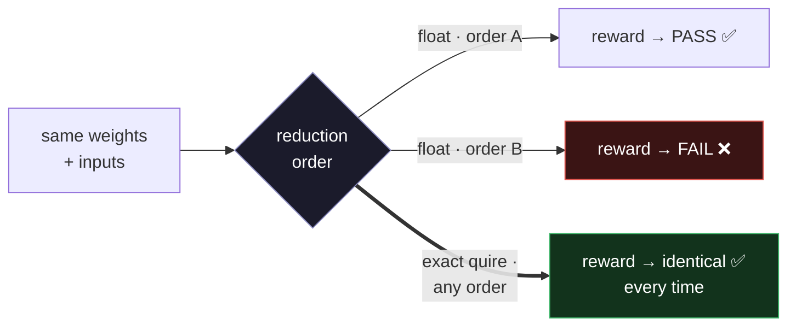

<!-- Copyright (c) 2026 Anomly, Inc. Author: Ry Bruscoe. Licensed under the Apache License, Version 2.0. -->
# RL / verifier reproducibility demo

[](https://github.com/anomly-labs/rl-reproducibility/actions/workflows/ci.yml)


```text
        ╔══════════════════════════════════════════════════════════════════════╗
        ║   the SAME reward · the SAME weights · a different (valid) sum order  ║
        ╚══════════════════════════════════════════════════════════════════════╝

             reward(answer)  =   Σ  wᵢ · aᵢ        ← re-order the sum, and:
                                  i

               float engine  →   0.50003  PASS        0.49998  FAIL     ← 17.6% of
                                                                          the boundary
               exact  quire  →   0.50000  PASS        0.50000  PASS     ← 0 flips, ever
                                 └──────────── bit-identical, every run ─────────┘

           float's verdict depends on the accumulation ORDER.  exact's never does.
```

**Float accumulation *order* alone changes reward verdicts and sampler/trainer probabilities — on real
GPT-2 weights, on your laptop, in seconds. An order-independent reduction removes it, bit-for-bit.**



This is the problem behind the *training–inference mismatch* and *verifier nondeterminism* that RL
post-training teams are patching in software today. It's a property of the arithmetic, not the model.
Anomly puts an order-independent, exact reduction — a 256-bit b-posit **quire** — in silicon at
GPU-parity speed. This repo lets you reproduce the problem, and the class of fix, yourself.

## Quick start

```bash
pip install numpy          # that's the only dependency to run the demo
python demo.py
```

Runs in a few seconds on real GPT-2 embeddings (shipped as fixtures — no download, nothing synthetic).

## What it shows

```
[1] VERIFIER DETERMINISM — does a reward verifier flip pass/fail from float order?
  FLOAT verifier  -> non-unanimous verdict: 30/2048   in the boundary band: 30/170 (17.6%)
  EXACT verifier  -> flips: 0/2048   scores bit-identical under any order: True

[2] TRAINING-INFERENCE MISMATCH — do sampler & trainer disagree from float order?
  FLOAT  -> logits differing: 7492/8192   KL(sampler||trainer): mean 3.17e-02 max 4.97e-02
  EXACT  -> logits bit-identical under any order: 8192/8192   KL(orderA||orderB): 0.0 exactly

[3] RL LOOP FORK — does the same training run diverge just from sampler kernel shape?
  FLOAT  -> action streams identical across chunk: False   final weight max |delta|: 9.33e-03
  EXACT  -> action streams identical across chunk: True   final weights bit-equal: True
```
*(Your numbers will match — the inputs are fixed and disclosed. Whole suite runs in ~3s.)*

- **Verifier determinism** (`verifier_determinism.py`) — a reward-model score is a dot product compared
  to a threshold. Compute it in different bf16 reduction orders (the shapes that differ between serving
  configs) and answers near the boundary **flip pass/fail** — same answer, same weights, different
  reward. The order-independent reduction never flips.
- **Training–inference mismatch** (`tim.py`) — the trainer (sequential) and sampler (chunked-tree)
  accumulate the *same* GPT-2 logits in different orders and assign **different probabilities to the same
  tokens** (KL > 0). The order-independent reduction is bit-identical, KL = 0.
- **RL loop fork** (`grpo.py`) — a real GRPO loop (verifiable nearest-neighbour reward, reward learns
  0→0.48) run twice with identical seeds and data, changing **only** the sampler's split-K chunk shape.
  Under float the two runs **fork** — different sampled action streams, different trained weights — so
  you can't reproduce the run. Under the order-independent reduction they're **bit-identical** end to end.
  (Honest scope: at this scale it's a training-*reproducibility* failure; the behavioral pass/fail
  consequence is demo [1].)

## What's real, and what's honest scope

- **Real data:** real GPT-2 `wte` / `wpe` rows from the published `openai-community/gpt2` checkpoint
  (`regenerate_fixtures.py` rebuilds them). No synthetic numbers.
- **The float kernels** (`floatkernels.py`) are faithful reference implementations of the two real kernel
  families (trainer sequential vs sampler split-K tree), in bf16 — only the accumulation order differs.
- **The exact path** (`refquire.py`) is an *order-independent reference reduction* (correctly-rounded
  `math.fsum`, cross-checked against an arbitrary-precision big-int gold — run `python refquire.py`). It
  demonstrates the **property**: an order-independent accumulator eliminates the nondeterminism.
- **Anomly's silicon goes further and faster.** A 256-bit b-posit quire keeps the *products* exact too
  and runs at GPU-parity throughput — measured **131,072 / 131,072 outputs bit-identical** on our Alveo
  U200 engine, with a reward verifier's flip-rate driven to **zero**. This repo proves the class of fix;
  the fast, fully-exact hardware datapath is Anomly's.

We certify **reproducibility** — the same defined computation, bit-identical anywhere — not mathematical
exactness of transcendentals.

## Files

| file | what |
|---|---|
| `demo.py` | runs all three demonstrations, one consolidated verdict |
| `verifier_determinism.py` | reward-verifier flip demo |
| `tim.py` | training–inference mismatch demo |
| `grpo.py` | RL-loop-fork demo (training run diverges under float) |
| `refquire.py` | order-independent exact reference reduction (+ big-int gold check) |
| `floatkernels.py` | the order-dependent bf16 serving/training kernels |
| `regenerate_fixtures.py` | rebuild the real GPT-2 fixtures from the public checkpoint |

## About Anomly

Anomly builds AI compute that returns **exact, reproducible answers by default** — a b-posit number
format with a 256-bit quire, so accumulation is order-independent and bit-identical across hardware.
Silicon-proven (a 625-core engine on an Alveo U200 FPGA; a first SKY130 tapeout; running on Tenstorrent
Blackhole), formally verified, and validated by John Gustafson — inventor of the posit/quire arithmetic.

If reproducible RL, stable verifiers, or auditable inference matter to you, we'd love to run a short
pilot measuring the flip-rate on *your* models and taking it to zero.

**Anomly, Inc. · https://www.anomly.com/contact**

## License

Apache-2.0 (see `LICENSE` and `NOTICE`). This repo is a demonstration; the Apache-2.0 patent grant
covers only the code here, which contains none of Anomly's b-posit / quire silicon IP or patents.
